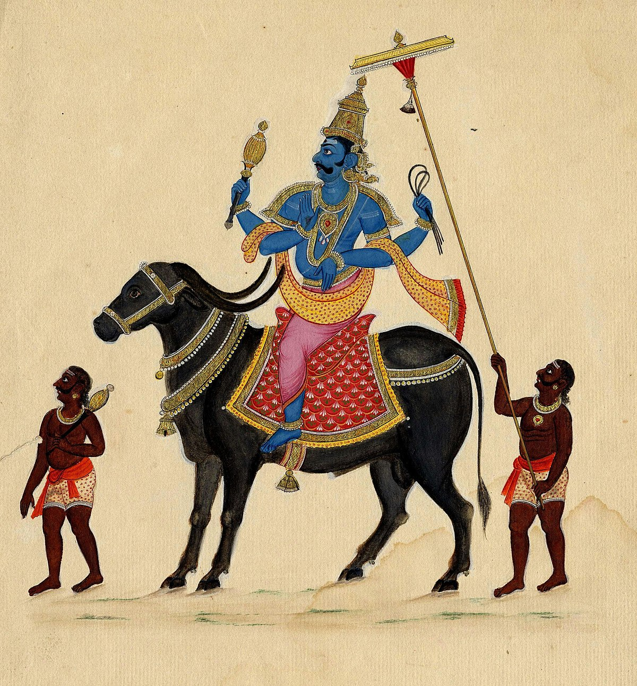

# Yama
Interface for religions

  

***Yama** is the god of death in Hinduism, known as the judge of the departed. He is the righteosness and moral order guy, enforcing the cosmic laws that govern life and death.*

## Thoughts

I am interested in building up a framework that analyzes as many religions as possible and picks up the common themes and sees if it's possible to build up an interface. 

Generally speaking, religion historically seems to have a step ladder, where each religion is sort of based on a predecessar relgiion. 

This is quite easy to understand for Abrahamic religions
*write down thoughts*

## Religions

Text associated with religion (for the purposes of this project I am assuming the text comprises the religion - will expand and add more):

1. Hinduism
   1. Bhagavad Gita (by Sri Swami Sivananda)
   2. Upanishads (by Swami Paramananda)
   3. Vedas 
      1. Rig Veda – RT Griffith
      2. Yajur Veda – AB Keith
      3. Hymns of Sama Veda – RT Griffith
      4. Hymns of Atharva Veda – M Bloomfiel
2. Islam
   1. Quran (Translated by Talal Itani)
   2. Hadith (by Sahih Al-Bukhari Book 1 - 93)
